# CVBuilder

[](https://github.com/mihaelamj/cvbuilder/actions/workflows/style.yml)
[](https://github.com/mihaelamj/cvbuilder/actions/workflows/swift-macos.yml)
[](https://github.com/mihaelamj/cvbuilder/actions/workflows/swift-linux.yml)

Follow project updates at [@diyamantina](https://x.com/diyamantina).

CVBuilder is a Pure Swift technical CV generator. It keeps CV data in typed
Swift or JSON, renders deterministic Markdown, and provides a Linux-facing
TileDown adapter for Markdown publishing workflows.

The core package is built for macOS and Linux. `CVDocument` is the canonical
source of truth for publishable CV data, front matter, links, public evidence,
and rendering options.

## What Works Today

CVBuilder currently renders inspectable Markdown from structured CV data. The
output is deterministic, byte-for-byte testable, and intentionally conservative.

The generic renderer currently covers:

- Front matter for static site generators.
- Headings, paragraphs, links, and labelled text lines.
- Contact information, education, work experience, projects, skills, public
  evidence, and profile/download links.
- Rendering modes for experienced, early-career, and public-evidence-heavy
  technical CV ordering.
- Optional explicit ordered work-entry selection for relevant older jobs before
  recency limits are applied.
- JSON input with ergonomic defaults for missing optional arrays.
- CLI output checks for checked-in generated Markdown.
- Linux TileDown compatibility through a Markdown-only adapter.

The compatibility target is structured technical CV data to Markdown. The
demo fixture now includes multi-role work history, nested projects, public
evidence, and omitted older jobs so template behavior is visible in tests.

## Package Products

| Product | Kind | Purpose |
|---|---|---|
| `CVBuilder` | Library | Core CV data model, document model, and Markdown/plain text renderers. |
| `CVBuilderTileDown` | Library | Linux-only Markdown adapter for TileDown workflows. |
| `cvbuilder` | Executable | `CVDocument` JSON file to Markdown or normalized JSON command. |

`CVBuilderTileDown` is available only when the package is built on Linux. iOS
support is not claimed.

## Quick Start

Use the document renderer directly:

```swift
import CVBuilder

let resume = CV(
    name: "Demo Candidate",
    title: "Senior Swift Engineer",
    summary: "Builds typed Swift tooling for document workflows.",
    contactInfo: ContactInfo(
        email: "demo.candidate@example.com",
        phone: "+1 555 010 0701",
        location: "Example City"
    ),
    experience: [],
    education: [],
    skills: [
        Tech(name: "Swift", category: .language),
        Tech(name: "Linux", category: .platform),
    ]
)

let document = CVDocument(
    frontMatter: ["slug": "demo-cv", "title": "Demo CV"],
    cv: resume
)

let markdown = Rendering.MarkdownDocumentRenderer().render(document)
```

Use the Linux-facing product:

```swift
import CVBuilderTileDown

let markdown = CVBuilderTileDown.Renderer().render(document)
```

The TileDown adapter returns Markdown only. It does not run TileDown, render
PDF, render HTML, write files, or import Apple UI frameworks. The full adapter
contract is documented in
[docs/tiledown-markdown-contract.md](docs/tiledown-markdown-contract.md).

Run the CV CLI:

```sh
swift run cvbuilder --data cv.json --out cv/index.md
```

Validate a CVDocument without writing output:

```sh
swift run cvbuilder --data cv.json --validate
```

Print the checked-in JSON Schema:

```sh
swift run cvbuilder -- --print-schema
```

Create a starter JSON document:

```sh
swift run cvbuilder -- --init cv.json
```

Show CLI usage:

```sh
swift run cvbuilder -- --help
```

Write normalized JSON:

```sh
swift run cvbuilder --data cv.json --out cv.normalized.json --format json
```

Check a generated Markdown file:

```sh
swift run cvbuilder --data cv.json --out cv/index.md --check
```

Compose through standard input and output:

```sh
cat cv.json | swift run cvbuilder --data - --out -
```

## JSON Input

The CLI reads one `CVDocument` JSON file. Missing optional arrays default to
empty values. This small document is valid input:

```json
{
  "frontMatter": {
    "slug": "demo-cv",
    "title": "Demo CV"
  },
  "cv": {
    "name": "Demo Candidate",
    "title": "Senior Swift Engineer",
    "summary": "Builds typed Swift tooling for document workflows.",
    "contactInfo": {
      "email": "demo.candidate@example.com",
      "phone": "+1 555 010 0701",
      "location": "Example City"
    },
    "skills": [
      { "name": "Swift", "category": "language" },
      { "name": "Linux", "category": "platform" }
    ]
  }
}
```

The full data contract, Markdown behavior, decoding defaults, and migration
rules are documented in
[docs/cvdocument-contract.md](docs/cvdocument-contract.md). A complete
handwritten fixture lives at [Examples/democv/cv.json](Examples/democv/cv.json).
Editor-oriented schema metadata lives at
[Schemas/cvdocument.schema.json](Schemas/cvdocument.schema.json).
The file-driven authoring flow is documented in
[docs/json-workflow.md](docs/json-workflow.md).

## CVBuilder roadmap

Epic [#28](https://github.com/mihaelamj/cvbuilder/issues/28) tracks the product
roadmap. Epic [#12](https://github.com/mihaelamj/cvbuilder/issues/12) tracked
the evidence-backed implementation slices that hardened the renderer and JSON
workflow. Epic [#47](https://github.com/mihaelamj/cvbuilder/issues/47) completed
release-ready authoring and CLI usability. Epic
[#57](https://github.com/mihaelamj/cvbuilder/issues/57) completed first public
release hardening and tag proof. Epic
[#67](https://github.com/mihaelamj/cvbuilder/issues/67) reconciles release
version history before publication. Epic
[#80](https://github.com/mihaelamj/cvbuilder/issues/80) is active for the
authoring and publishing experience.

```mermaid
flowchart TD
    P1["Phase 1<br/>#26 Linux Markdown foundation<br/>Done"]
    P2["Phase 2<br/>#29 CVDocument data contract<br/>Done"]
    P3["Phase 3<br/>#30 Technical CV rendering modes<br/>Done"]
    P4["Phase 4<br/>#31 TileDown Markdown contract<br/>Done"]
    P5["Phase 5<br/>#32 Quality gates and release hygiene<br/>Done"]
    P6["Phase 6<br/>#40 Realistic fixture coverage<br/>Done"]
    P7["Phase 7<br/>#19 Evidence fixture proofs<br/>Done"]
    P8["Phase 8<br/>#20 Workflow documentation<br/>Done"]
    P9["Phase 9<br/>#48 CLI help<br/>Done"]
    P10["Phase 10<br/>#49 JSON Schema<br/>Done"]
    P11["Phase 11<br/>#50 Schema drift checks<br/>Done"]
    P12["Phase 12<br/>#51 Release checklist<br/>Done"]
    P13["Phase 13<br/>#58 Release tag CI<br/>Done"]
    P14["Phase 14<br/>#61 Platform contract<br/>Done"]
    P15["Phase 15<br/>#60 Consumer smoke<br/>Done"]
    P16["Phase 16<br/>#59 Release notes draft<br/>Done"]
    P17["Phase 17<br/>#68 Version history docs<br/>Done"]
    P18["Phase 18<br/>#69 Version guard<br/>Done"]
    P19["Phase 19<br/>#70 Publish proof<br/>Done"]
    P20["Phase 20<br/>#74 Legacy CV path<br/>Done"]
    P21["Phase 21<br/>#75 Conformance matrix<br/>Done"]
    P22["Phase 22<br/>#81 CLI authoring<br/>Done"]
    P23["Phase 23<br/>#82 Front matter profiles<br/>Review"]
    P24["Phase 24<br/>#83 JSON Resume interop<br/>Todo"]
    P25["Phase 25<br/>#84 Localization<br/>Todo"]

    P1 --> P2 --> P3 --> P4 --> P5 --> P6 --> P7 --> P8 --> P9 --> P10 --> P11 --> P12 --> P13 --> P14 --> P15 --> P16 --> P17 --> P18 --> P19 --> P20 --> P21 --> P22 --> P23 --> P24 --> P25

    classDef done fill:#e8f5e9,stroke:#2e7d32,color:#111;
    classDef active fill:#fff3e0,stroke:#ef6c00,color:#111;
    classDef review fill:#e8f0fe,stroke:#1a73e8,color:#111;
    classDef next fill:#fff8e1,stroke:#f9a825,color:#111;
    classDef partial fill:#e0f7fa,stroke:#00838f,color:#111;
    classDef todo fill:#eef3ff,stroke:#3367d6,color:#111;
    class P1,P2,P3,P4 done;
    class P5,P6,P7,P8,P9,P10,P11,P12,P13,P14,P15,P16 done;
    class P17 done;
    class P18 done;
    class P19 done;
    class P20 done;
    class P21 done;
    class P22 done;
    class P23 review;
    class P24,P25 todo;
```



See [docs/roadmap.md](docs/roadmap.md) for the full roadmap.

## Validation

The test suite validates generated Markdown through fixture and behavior checks:

- Snapshot-style expectations check section ordering, headings, links, escaping,
  evidence rendering, and checked-in rendering-mode fixtures.
- Demo fixture tests cover realistic nested projects, omitted older jobs, and
  explicit selection of relevant work entries.
- Resource-backed JSON fixtures cover minimal, early-career, hostile Markdown,
  and full senior technical CV documents.
- Hostile text tests ensure generated Markdown treats source data as data, not
  structure.
- JSON schema tests check defaults for omitted optional arrays and rejection of
  explicit invalid nulls.
- CLI tests check Markdown output, normalized JSON output, and stale-file
  detection.
- Linux-only TileDown tests compare adapter output to canonical Markdown output
  and the checked-in TileDown example.

## Build and Test

```sh
swift build --target CVBuilder
swift build --target CVBuilderCLI
swift build --product cvbuilder
swift test
```

The schema drift check validates the checked-in example and fixture JSON files
against the public `CVDocument` JSON Schema:

```sh
bash scripts/check-schema-drift.sh
```

The same core package is expected to build on macOS and Linux. GitHub CI runs
style, macOS Swift, and Linux Swift workflows.

Useful local checks from the repository root:

```sh
bash scripts/check-style.sh
bash scripts/check-namespacing.sh
bash scripts/check-platform-contract.sh
bash scripts/check-release-version.sh
bash scripts/test-quality-gates.sh
bash scripts/check-schema-drift.sh
bash scripts/check-generated-fixtures.sh
bash scripts/check-consumer-smoke.sh
swiftformat . --config .swiftformat --lint
swiftlint --config .swiftlint.yml --strict
```

Every pull request also needs a `## Roadmap` section naming the issue or phase
it advances. CI enforces this on pull requests.

To check a draft PR body locally:

```sh
PR_BODY_FILE=/path/to/pr-body.md bash scripts/check-pr-roadmap.sh
```

On Linux, also verify the TileDown adapter:

```sh
swift build --target CVBuilderTileDown
```

## Documentation

- [CHANGELOG.md](CHANGELOG.md): notable user-facing changes.
- [CONTRIBUTING.md](CONTRIBUTING.md): contribution rules and local checks.
- [SUPPORT.md](SUPPORT.md): where to file bugs, feature requests, and security issues.
- [docs/roadmap.md](docs/roadmap.md): product roadmap and ordered issue plan.
- [docs/cvdocument-contract.md](docs/cvdocument-contract.md): JSON schema,
  Markdown behavior, and migration rules.
- [docs/json-workflow.md](docs/json-workflow.md): file-driven JSON to Markdown
  workflow, CI checks, SSG integration, and product boundaries.
- [docs/front-matter-profiles.md](docs/front-matter-profiles.md): generic,
  Toucan, Hugo, and Jekyll front matter profiles.
- [docs/release-checklist.md](docs/release-checklist.md): Markdown-first
  release gates, tag process, release-note expectations, and boundaries.
- [docs/release-notes/v0.9.0.md](docs/release-notes/v0.9.0.md): release
  notes for the first Markdown-first release tag.
- [Schemas/cvdocument.schema.json](Schemas/cvdocument.schema.json):
  machine-readable JSON Schema for editor validation and completion.
- [docs/rendering-modes.md](docs/rendering-modes.md): rendering policy names,
  evidence mapping, and mode fixture coverage.
- [docs/tiledown-markdown-contract.md](docs/tiledown-markdown-contract.md):
  Linux adapter guarantees, front matter behavior, and fixture workflow.
- [Examples/tiledown/democv.md](Examples/tiledown/democv.md): generated
  TileDown-oriented Markdown example.
- [docs/research/README.md](docs/research/README.md): research map.
- [docs/research/cvbuilder-evidence-summary.md](docs/research/cvbuilder-evidence-summary.md):
  evidence summary for technical CV decisions.
- [docs/research/cvbuilder-proof-matrix.md](docs/research/cvbuilder-proof-matrix.md):
  source-to-claim proof matrix.
- [docs/research/cvbuilder-deep-review-protocol.md](docs/research/cvbuilder-deep-review-protocol.md):
  deeper research protocol.

## Platform Boundaries

- Portable behavior means macOS and Linux.
- `CVBuilderTileDown` is a Linux target hook, not a separate renderer backend.
- TileDown receives Markdown only.
- `scripts/check-consumer-smoke.sh` proves a clean SwiftPM package can import
  public CVBuilder products before release.
- iOS support is not implemented or tested.
- `Package.swift` must not declare iOS support until that support is tested and
  documented.
- Research source snapshots, when present, are evidence only. They are not
  package dependencies.

## Design Constraints

- Pure Swift source.
- Deterministic Markdown generation from typed data.
- No runtime shell-out to another renderer during rendering.
- No PDF renderer in the core package.
- No ATS scoring, resume optimizer claims, personality labels, demographic
  labels, or inferred fit labels.
- No layout-driven Markdown tables, columns, image rendering, or photo handling
  in the canonical document renderer.
- No default Ignite or other HTML renderer dependency.
- Linux support through Foundation and Swift Package Manager.
- Small, testable public API.

## License

See [LICENSE](LICENSE).
