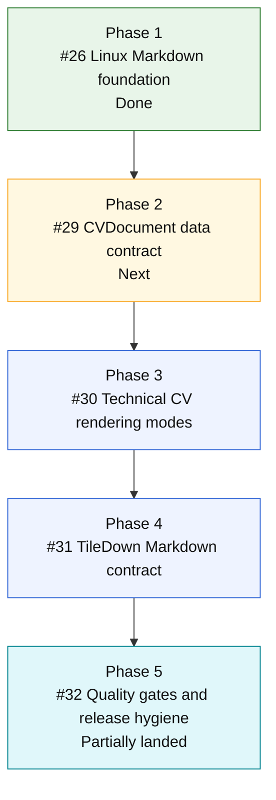

# CVBuilder

[](https://github.com/mihaelamj/cvbuilder/actions/workflows/style.yml)
[](https://github.com/mihaelamj/cvbuilder/actions/workflows/swift-macos.yml)
[](https://github.com/mihaelamj/cvbuilder/actions/workflows/swift-linux.yml)

Follow project updates at [@diyamantina](https://x.com/diyamantina).

CVBuilder is a Pure Swift technical CV generator. It keeps CV data in typed
Swift or JSON, renders deterministic Markdown, and provides a Linux-facing
TileDown adapter for Markdown publishing workflows.

The core package is built for macOS and Linux. `CVDocument` is the canonical
source of truth for publishable CV data, front matter, links, public evidence,
and rendering options.

## What Works Today

CVBuilder currently renders inspectable Markdown from structured CV data. The
output is deterministic, byte-for-byte testable, and intentionally conservative.

The generic renderer currently covers:

- Front matter for static site generators.
- Headings, paragraphs, links, and labelled text lines.
- Contact information, education, work experience, projects, skills, public
  evidence, and profile/download links.
- Rendering modes for experienced and early-career technical CV ordering.
- JSON input with ergonomic defaults for missing optional arrays.
- CLI output checks for checked-in generated Markdown.
- Linux TileDown compatibility through a Markdown-only adapter.

The compatibility target is structured technical CV data to Markdown. The
generated profile is intentionally small while the document contract and
technical CV templates are being hardened.

## Package Products

| Product | Kind | Purpose |
|---|---|---|
| `CVBuilder` | Library | Core CV data model, document model, and Markdown/plain text renderers. |
| `CVBuilderTileDown` | Library | Linux-only Markdown adapter for TileDown workflows. |
| `cvbuilder` | Executable | `CVDocument` JSON file to Markdown or normalized JSON command. |

`CVBuilderTileDown` is available only when the package is built on Linux. iOS
support is not claimed.

## Quick Start

Use the document renderer directly:

```swift
import CVBuilder

let resume = CV(
    name: "Demo Candidate",
    title: "Senior Swift Engineer",
    summary: "Builds typed Swift tooling for document workflows.",
    contactInfo: ContactInfo(
        email: "demo.candidate@example.com",
        phone: "+1 555 010 0701",
        location: "Example City"
    ),
    experience: [],
    education: [],
    skills: [
        Tech(name: "Swift", category: .language),
        Tech(name: "Linux", category: .platform),
    ]
)

let document = CVDocument(
    frontMatter: ["slug": "demo-cv", "title": "Demo CV"],
    cv: resume
)

let markdown = Rendering.MarkdownDocumentRenderer().render(document)
```

Use the Linux-facing product:

```swift
import CVBuilderTileDown

let markdown = CVBuilderTileDown.Renderer().render(document)
```

Run the CV CLI:

```sh
swift run cvbuilder --data cv.json --out cv/index.md
```

Write normalized JSON:

```sh
swift run cvbuilder --data cv.json --out cv.normalized.json --format json
```

Check a generated Markdown file:

```sh
swift run cvbuilder --data cv.json --out cv/index.md --check
```

## JSON Input

The CLI reads one `CVDocument` JSON file. Missing optional arrays default to
empty values. This small document is valid input:

```json
{
  "frontMatter": {
    "slug": "demo-cv",
    "title": "Demo CV"
  },
  "cv": {
    "name": "Demo Candidate",
    "title": "Senior Swift Engineer",
    "summary": "Builds typed Swift tooling for document workflows.",
    "contactInfo": {
      "email": "demo.candidate@example.com",
      "phone": "+1 555 010 0701",
      "location": "Example City"
    },
    "skills": [
      { "name": "Swift", "category": "language" },
      { "name": "Linux", "category": "platform" }
    ]
  }
}
```

## CVBuilder roadmap

Epic [#28](https://github.com/mihaelamj/cvbuilder/issues/28) tracks the ordered
path from the current Markdown foundation to stable technical CV templates.



See [docs/roadmap.md](docs/roadmap.md) for the full roadmap.

## Validation

The test suite validates generated Markdown in four ways:

- Snapshot-style expectations check section ordering, headings, links, escaping,
  and evidence rendering.
- Hostile text tests ensure generated Markdown treats source data as data, not
  structure.
- JSON schema tests check defaults for omitted optional arrays and rejection of
  explicit invalid nulls.
- CLI tests check Markdown output, normalized JSON output, and stale-file
  detection.

## Build and Test

```sh
swift build --target CVBuilder
swift build --target CVBuilderCLI
swift build --product cvbuilder
swift test
```

The same core package is expected to build on macOS and Linux. GitHub CI runs
style, macOS Swift, and Linux Swift workflows.

Useful local checks from the repository root:

```sh
bash scripts/check-style.sh
bash scripts/check-namespacing.sh
swiftformat . --config .swiftformat --lint
swiftlint --config .swiftlint.yml --strict
```

On Linux, also verify the TileDown adapter:

```sh
swift build --target CVBuilderTileDown
```

## Documentation

- [CHANGELOG.md](CHANGELOG.md): notable user-facing changes.
- [CONTRIBUTING.md](CONTRIBUTING.md): contribution rules and local checks.
- [SUPPORT.md](SUPPORT.md): where to file bugs, feature requests, and security issues.
- [docs/roadmap.md](docs/roadmap.md): product roadmap and ordered issue plan.
- [docs/research/README.md](docs/research/README.md): research map.
- [docs/research/cvbuilder-evidence-summary.md](docs/research/cvbuilder-evidence-summary.md):
  evidence summary for technical CV decisions.
- [docs/research/cvbuilder-proof-matrix.md](docs/research/cvbuilder-proof-matrix.md):
  source-to-claim proof matrix.
- [docs/research/cvbuilder-deep-review-protocol.md](docs/research/cvbuilder-deep-review-protocol.md):
  deeper research protocol.

## Platform Boundaries

- Portable behavior means macOS and Linux.
- `CVBuilderTileDown` is a Linux target hook, not a separate renderer backend.
- TileDown receives Markdown only.
- iOS support is not implemented or tested.
- Research source snapshots, when present, are evidence only. They are not
  package dependencies.

## Design Constraints

- Pure Swift source.
- Deterministic Markdown generation from typed data.
- No runtime shell-out to another renderer during rendering.
- No PDF renderer in the core package.
- No ATS scoring, resume optimizer claims, personality labels, demographic
  labels, or inferred fit labels.
- No layout-driven Markdown tables, columns, image rendering, or photo handling
  in the canonical document renderer.
- No default Ignite or other HTML renderer dependency.
- Linux support through Foundation and Swift Package Manager.
- Small, testable public API.

## License

See [LICENSE](LICENSE).
