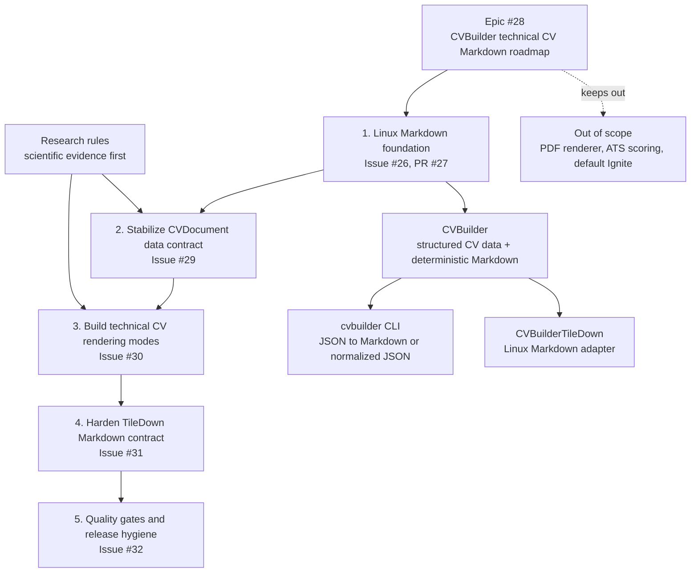

# CVBuilder

CVBuilder is a Swift package for keeping technical CV data in structured Swift
or JSON and rendering deterministic Markdown. The package is Markdown-first and
Linux-safe. It does not include a PDF renderer, ATS scoring, resume optimizer
claims, or a default HTML renderer.

## Features

- Strongly typed CV model for contact info, education, work experience,
  projects, periods, roles, and technologies.
- `CVDocument` publishing wrapper for front matter, links, public evidence, and
  rendering options.
- Deterministic Markdown through `Rendering.MarkdownDocumentRenderer`.
- Legacy CV-only Markdown through `MarkdownCVRenderer`.
- Plain text rendering through `StringCVRenderer`.
- `cvbuilder` CLI for JSON to Markdown and JSON normalization.
- Linux-only `CVBuilderTileDown` adapter that emits Markdown only.

The document renderer intentionally emits conservative Markdown: front matter,
headings, paragraphs, links, and labelled lines. It does not render tables,
columns, images, score-like fields, demographic metadata, or inferred fit
labels.

## Roadmap

The current product direction is documented in [docs/roadmap.md](docs/roadmap.md).



---

## Package Structure

This package includes one core library, one command-line executable, and one Linux-only adapter target:

### 1. `CVBuilder` (core)

Contains model types and renderer implementations:

```
CVBuilder
|-- CV
|-- CVDocument
|-- ContactInfo
|-- Education
|-- WorkExperience
|-- ProjectExperience
|-- Project
|-- Tech
|-- Rendering.MarkdownDocumentRenderer
|-- MarkdownCVRenderer
`-- StringCVRenderer
```

### 2. `cvbuilder` (executable)

Generates Markdown or normalized JSON from one `CVDocument` JSON file.

### 3. `CVBuilderTileDown` (Linux only)

Provides `CVBuilderTileDown.Renderer`, which renders `CVDocument` or legacy `CV`
values into Markdown for a TileDown-driven publishing pipeline. It does not
generate PDF output.

## Usage

### Add to your `Package.swift`

```swift
.package(url: "https://github.com/mihaelamj/cvbuilder.git", branch: "main")
```

Then add the desired product:

```swift
.product(name: "CVBuilder", package: "cvbuilder")
```

The package also exposes the `cvbuilder` executable product for `swift run cvbuilder`.

On Linux only:

```swift
.product(name: "CVBuilderTileDown", package: "cvbuilder")
```

`CVBuilderTileDown` is only present when SwiftPM evaluates the package on Linux.

## Input JSON

The CLI reads a `CVDocument` JSON file. Missing optional arrays default to empty
values. This small document is valid input:

```json
{
  "frontMatter": {
    "slug": "demo-cv",
    "title": "Demo CV"
  },
  "cv": {
    "name": "Demo Candidate",
    "title": "Senior Swift Engineer",
    "summary": "Builds typed Swift tooling for document workflows.",
    "contactInfo": {
      "email": "demo.candidate@example.com",
      "phone": "+1 555 010 0701",
      "location": "Example City"
    },
    "skills": [
      { "name": "Swift", "category": "language" },
      { "name": "Linux", "category": "platform" }
    ]
  }
}
```

## CLI

```sh
swift run cvbuilder --data cv.json --out cv/index.md
```

To write normalized `CVDocument` JSON instead of Markdown:

```sh
swift run cvbuilder --data cv.json --out cv.normalized.json --format json
```

To verify that a checked-in output file is current without writing it:

```sh
swift run cvbuilder --data cv.json --out cv/index.md --check
```

The CLI supports `--format markdown` and `--format json`. It does not generate PDF output, ATS scores, or resume-optimizer content.

## Swift API

```swift
import CVBuilder

let resume = CV(
    name: "Demo Candidate",
    title: "Senior Swift Engineer",
    summary: "Builds typed Swift tooling for document workflows.",
    contactInfo: ContactInfo(
        email: "demo.candidate@example.com",
        phone: "+1 555 010 0701",
        location: "Example City"
    ),
    experience: [],
    education: [],
    skills: [
        Tech(name: "Swift", category: .language),
        Tech(name: "Linux", category: .platform)
    ]
)

let document = CVDocument(
    frontMatter: ["slug": "demo-cv", "title": "Demo CV"],
    cv: resume
)

let markdown = Rendering.MarkdownDocumentRenderer().render(document)
```

The legacy `MarkdownCVRenderer` remains available for callers that only have a
`CV` value:

```swift
let markdown = MarkdownCVRenderer().render(cv: resume)
```

On Linux, TileDown integrations can depend on `CVBuilderTileDown`:

```swift
#if os(Linux)
import CVBuilderTileDown

let markdown = CVBuilderTileDown.Renderer().render(document)
#endif
```

## Verification

Run the cross-platform targets locally:

```sh
swift build --target CVBuilder
swift build --target CVBuilderCLI
swift build --product cvbuilder
swift test
```

On Linux, also verify the TileDown adapter:

```sh
swift build --target CVBuilderTileDown
```

## License

MIT. See `LICENSE` file for details.
