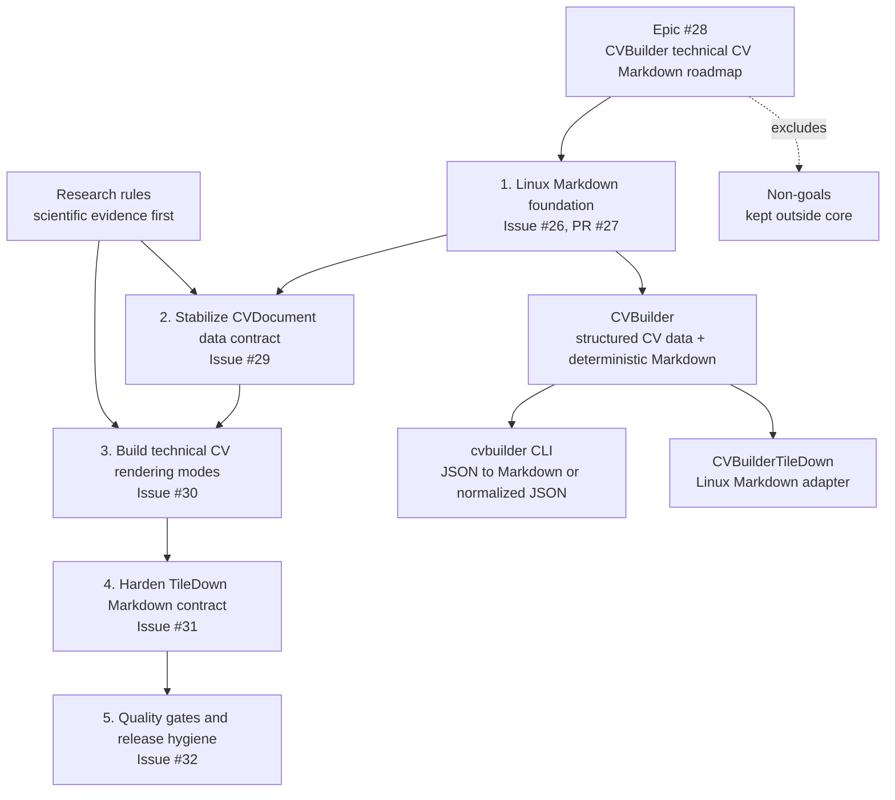

# CVBuilder

[](https://github.com/mihaelamj/cvbuilder/actions/workflows/ci.yml)
[](https://github.com/mihaelamj/cvbuilder/actions/workflows/ci.yml)
[](Package.swift)

CVBuilder is a Swift package for typed technical CV data and deterministic
Markdown output. It is built around one source of truth, `CVDocument`, which can
be written in Swift or decoded from JSON and rendered by the library or CLI.

The package is Markdown-first and Linux-safe. It is meant for checked-in CV
pages, technical CV variants, and TileDown publishing workflows that consume
Markdown.

## Quick Start

Add the package:

```swift
.package(url: "https://github.com/mihaelamj/cvbuilder.git", branch: "main")
```

Add the core product to your target:

```swift
.product(name: "CVBuilder", package: "cvbuilder")
```

On Linux, TileDown integrations can also depend on:

```swift
.product(name: "CVBuilderTileDown", package: "cvbuilder")
```

`CVBuilderTileDown` is only present when SwiftPM evaluates the package on Linux.

## CLI

Render Markdown from a `CVDocument` JSON file:

```sh
swift run cvbuilder --data cv.json --out cv/index.md
```

Write normalized `CVDocument` JSON:

```sh
swift run cvbuilder --data cv.json --out cv.normalized.json --format json
```

Verify that a checked-in output file is current:

```sh
swift run cvbuilder --data cv.json --out cv/index.md --check
```

The CLI supports `--format markdown` and `--format json`.

## JSON Input

The CLI reads a `CVDocument` JSON file. Missing optional arrays default to empty
values. This small document is valid input:

```json
{
  "frontMatter": {
    "slug": "demo-cv",
    "title": "Demo CV"
  },
  "cv": {
    "name": "Demo Candidate",
    "title": "Senior Swift Engineer",
    "summary": "Builds typed Swift tooling for document workflows.",
    "contactInfo": {
      "email": "demo.candidate@example.com",
      "phone": "+1 555 010 0701",
      "location": "Example City"
    },
    "skills": [
      { "name": "Swift", "category": "language" },
      { "name": "Linux", "category": "platform" }
    ]
  }
}
```

## Swift API

```swift
import CVBuilder

let resume = CV(
    name: "Demo Candidate",
    title: "Senior Swift Engineer",
    summary: "Builds typed Swift tooling for document workflows.",
    contactInfo: ContactInfo(
        email: "demo.candidate@example.com",
        phone: "+1 555 010 0701",
        location: "Example City"
    ),
    experience: [],
    education: [],
    skills: [
        Tech(name: "Swift", category: .language),
        Tech(name: "Linux", category: .platform)
    ]
)

let document = CVDocument(
    frontMatter: ["slug": "demo-cv", "title": "Demo CV"],
    cv: resume
)

let markdown = Rendering.MarkdownDocumentRenderer().render(document)
```

Legacy `CV` values can still be rendered directly:

```swift
let markdown = MarkdownCVRenderer().render(cv: resume)
```

On Linux, TileDown can use the adapter target:

```swift
#if os(Linux)
import CVBuilderTileDown

let markdown = CVBuilderTileDown.Renderer().render(document)
#endif
```

## Renderers

- `Rendering.MarkdownDocumentRenderer` renders complete `CVDocument` values.
- `MarkdownCVRenderer` renders legacy `CV` values.
- `StringCVRenderer` renders plain text.
- `CVBuilderTileDown.Renderer` is a Linux-only adapter that delegates to the
  Markdown renderers.

The canonical document renderer emits conservative Markdown: front matter,
headings, paragraphs, links, and labelled lines. Output is deterministic and
byte-for-byte testable.

## Package Layout

This package includes one core library, one executable, and one Linux-only
adapter target:

```
CVBuilder
|-- CV
|-- CVDocument
|-- ContactInfo
|-- Education
|-- WorkExperience
|-- ProjectExperience
|-- Project
|-- Tech
|-- Rendering.MarkdownDocumentRenderer
|-- MarkdownCVRenderer
`-- StringCVRenderer
```

Products:

- `CVBuilder`: core library
- `cvbuilder`: executable for `swift run cvbuilder`
- `CVBuilderTileDown`: Linux-only Markdown adapter

## Verification

Run the cross-platform targets locally:

```sh
swift build --target CVBuilder
swift build --target CVBuilderCLI
swift build --product cvbuilder
swift test
```

On Linux, also verify the TileDown adapter:

```sh
swift build --target CVBuilderTileDown
```

## Roadmap

The current product direction is documented in [docs/roadmap.md](docs/roadmap.md).



## License

MIT. See `LICENSE` file for details.

## Non-goals

These are intentionally outside the current package:

- PDF rendering.
- ATS scoring or resume optimizer claims.
- Score-like fields, demographic metadata, personality labels, or inferred fit
  labels.
- Layout-driven Markdown tables, columns, image rendering, or photo handling in
  the canonical document renderer.
- Default Ignite or other HTML renderer dependency.
