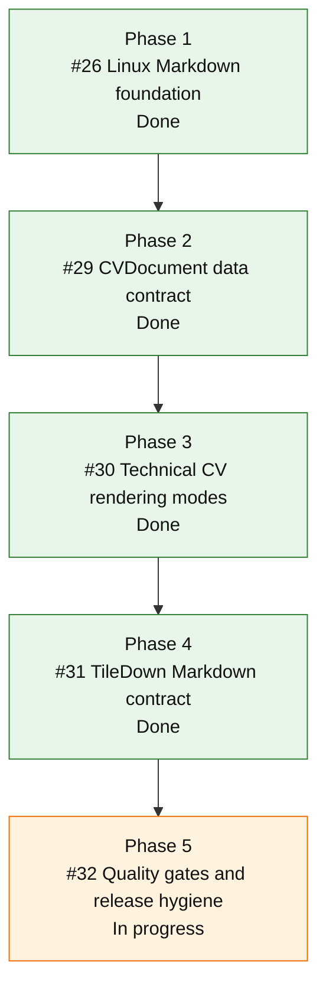

# CVBuilder Roadmap

Status date: 2026-06-01

This roadmap defines the product direction for `cvbuilder`. It is intentionally
Markdown-first and Linux-safe. The package owns CV data, validation, and
deterministic Markdown generation. Other tools may consume that Markdown.

## Goal

Build `cvbuilder` as the canonical Swift library and CLI for creating technical
CV Markdown from structured data.

The long-term product should let a user keep one typed CV source of truth and
generate predictable Markdown for:

- personal sites
- TileDown publishing workflows
- checked-in CV pages
- recruiter-facing technical CV variants

## Non-goals

These are outside `cvbuilder`:

- PDF rendering
- ATS scoring
- resume-optimizer claims
- skill bars, personality labels, fit scores, or culture-fit labels
- static-site generation
- default dependencies on HTML renderers such as Ignite

If PDF output returns later, it belongs in a separate renderer or tool that
consumes Markdown or structured `CVDocument` data. It does not belong in the
core package.

## Current State

### Landed on `main`

- `CVDocument` schema exists for file-driven CV generation.
- `cvbuilder` CLI can render Markdown from JSON.
- `cvbuilder` CLI can emit normalized JSON.
- `--check` mode can verify checked-in output.
- Research documents live in `docs/research`.
- PR #27 landed the Linux-only `CVBuilderTileDown` adapter.
- Default Ignite build participation is removed.
- TileDown remains scoped to Markdown only.
- Linux, macOS, style, namespacing, SwiftFormat, and SwiftLint gates are active.
- Community standards, issue templates, PR template, support policy, and
  changelog are present.

Relevant links:

- Issue #28: product roadmap epic with ordered child issues.
- Issue #3: file-driven CVBuilder implementation target.
- Issue #5: closed evidence research epic.
- Issue #26: closed Linux TileDown Markdown adapter.
- Issue #30: closed technical CV rendering modes.
- PR #27: merged Linux TileDown Markdown adapter implementation.
- PR #34: merged technical CV rendering modes implementation.

Ordered roadmap issues:

1. #26 - done: merge the Linux Markdown foundation.
2. #29 - done: stabilize the `CVDocument` data contract.
3. #30 - done: build technical CV rendering modes.
4. #31 - done: document and harden the TileDown Markdown contract.
5. #32 - in progress: add roadmap quality gates and release hygiene.

## Roadmap

### Phase 1: Merge the Linux Markdown Foundation

Objective: make the current Markdown-only, Linux-safe package shape the base for
all future work.

Issue: [#26](https://github.com/mihaelamj/cvbuilder/issues/26).

Deliverables:

- merge PR #27: done
- close issue #26 after merge: done
- keep GitHub Linux CI mandatory: done
- keep the CI guard that rejects `CVBuilderIgnite` in the Linux package graph:
  done
- keep `.claude/` and local generated artifacts out of commits: done

Acceptance:

- `swift test` passes on macOS: done
- Linux CI passes: done
- Claw Linux build and test pass when Linux-specific behavior changes
- `Package.swift` exposes `CVBuilderTileDown` only on Linux: done
- no PDF renderer exists in `Sources`: done
- no default Ignite dependency exists: done

### Phase 2: Stabilize the CV Data Contract

Objective: make `CVDocument` the durable source of truth for generated CVs.

Issue: [#29](https://github.com/mihaelamj/cvbuilder/issues/29).

Deliverables:

- document every public `CVDocument` field with expected Markdown behavior: done
- add fixture JSON files for realistic technical CV variants: done
- add schema tests for missing, empty, and invalid nested data: done
- add migration notes for future schema changes: done
- decide whether legacy `CV` rendering remains a compatibility path or becomes
  a thin adapter over `CVDocument`: done, it remains a compatibility path

Acceptance:

- a user can write one JSON file without reading source code: done
- generated Markdown is deterministic from that JSON: done
- invalid input fails with actionable CLI errors: done
- fixture tests prove all supported schema branches: done

### Phase 3: Build Technical CV Templates

Objective: turn the research findings into explicit rendering modes instead of
ad hoc Markdown tweaks.

Issue: [#30](https://github.com/mihaelamj/cvbuilder/issues/30).

Initial modes:

- experienced technical CV
- early-career technical CV
- public-evidence-heavy technical CV

Deliverables:

- template policy docs that map evidence rules to renderer behavior: done
- fixture Markdown snapshots for each mode: done
- tests for section order, heading levels, links, evidence summaries, and skill
  placement: done
- no hidden scoring or personality inference: done

Acceptance:

- each mode has a named rendering policy: done
- each mode has a fixture and expected Markdown output: done
- every template rule is either evidence-backed or marked as a pragmatic
  renderer convention: done

### Phase 4: Improve TileDown Automation

Objective: make TileDown consumption boring and predictable.

Issue: [#31](https://github.com/mihaelamj/cvbuilder/issues/31).

Deliverables:

- document the TileDown-compatible Markdown contract in
  `docs/tiledown-markdown-contract.md`: done
- add a TileDown fixture directory with generated Markdown examples under
  `Examples/tiledown`: done
- add tests that compare `CVBuilderTileDown.Renderer` output to canonical
  Markdown output: done
- clarify whether TileDown needs front matter conventions beyond current
  `CVDocument.frontMatter`: done

Acceptance:

- Linux users can import `CVBuilderTileDown` without Apple frameworks: done
- TileDown receives Markdown only: done
- output remains byte-for-byte deterministic: done
- TileDown integration does not pull in PDF, Ignite, or static-site generator
  dependencies: done

### Phase 5: Quality Gates and Release Hygiene

Objective: make regressions hard to ship.

Issue: [#32](https://github.com/mihaelamj/cvbuilder/issues/32).

Deliverables:

- keep Linux and macOS CI on every PR: done
- keep style and namespacing CI on every PR: done
- keep SwiftFormat and SwiftLint checks on macOS CI: done
- add a fixture freshness command if snapshots become checked in: in progress
- document local verification commands in README: done
- add issue-body links from roadmap phases to GitHub issues as they are filed:
  done
- add release notes when the first usable version is tagged: changelog scaffold
  exists; first tag still pending

Acceptance:

- every PR says which roadmap phase it advances: in progress
- every production behavior change has tests
- every generated artifact can be reproduced from source data
- roadmap state is updated when a phase starts, lands, or changes scope

## Research Rules

Research remains input to renderer policy, not a marketing claim.

Evidence priority:

1. Peer-reviewed scientific articles.
2. Meta-analyses, systematic reviews, and well-cited academic surveys.
3. Technical papers only when stronger evidence is missing.
4. Vendor docs and recruiter advice only for examples or implementation risks.

Current research conclusion:

- there is no magic universal best CV template
- structured, factual, job-relevant evidence matters most
- single source-order Markdown is safer than layout-driven semantics
- technologies should attach to concrete work where possible
- public technical evidence should be summarized with context
- demographic, personality, and score-like signals should not be generated

## Definition of Done

A roadmap item is done only when:

- implementation is merged to `main`
- Linux CI is green
- macOS CI is green
- tests cover the behavior
- README or docs describe the user-facing contract
- linked GitHub issues are updated or closed

An open PR is progress, not done.
