# CVBuilder Roadmap

Status date: 2026-06-02

This roadmap defines the product direction for `cvbuilder`. It is intentionally
Markdown-first and Linux-safe. The package owns CV data, validation, and
deterministic Markdown generation. Other tools may consume that Markdown.

## Goal

Build `cvbuilder` as the canonical Swift library and CLI for creating technical
CV Markdown from structured data.

The long-term product should let a user keep one typed CV source of truth and
generate predictable Markdown for:

- personal sites
- TileDown publishing workflows
- checked-in CV pages
- recruiter-facing technical CV variants

## Non-goals

These are outside `cvbuilder`:

- PDF rendering
- ATS scoring
- resume-optimizer claims
- skill bars, personality labels, fit scores, or culture-fit labels
- static-site generation
- default dependencies on HTML renderers such as Ignite

If PDF output returns later, it belongs in a separate renderer or tool that
consumes Markdown or structured `CVDocument` data. It does not belong in the
core package.

## Current State

### Landed on `main`

- `CVDocument` schema exists for file-driven CV generation.
- `cvbuilder` CLI can render Markdown from JSON.
- `cvbuilder` CLI can emit normalized JSON.
- `--check` mode can verify checked-in output.
- Research documents live in `docs/research`.
- PR #27 landed the Linux-only `CVBuilderTileDown` adapter.
- Default Ignite build participation is removed.
- TileDown remains scoped to Markdown only.
- Linux, macOS, style, namespacing, SwiftFormat, and SwiftLint gates are active.
- Community standards, issue templates, PR template, support policy, and
  changelog are present.
- The demo CV fixture exercises realistic multi-role technical CV behavior,
  omitted older jobs, and explicit relevance-selected jobs.
- Epic #47 completed release-ready authoring and CLI usability.
- Epic #57 completed first public release hardening and tag proof.
- Epic #67 completed release version reconciliation and `v0.9.0`
  publication proof.

### Active work

- Epic #76 is complete after PR #85.
- Issues #74 and #75 are done.
- Epic #80 is active for the authoring and publishing experience.
- Issue #81 is done after PR #97.
- Issue #82 is in review in PR #104.

Relevant links:

- Issue #28: product roadmap epic with ordered child issues.
- Issue #12: evidence-backed implementation epic.
- Issue #3: file-driven CVBuilder implementation target.
- Issue #5: closed evidence research epic.
- Issue #26: closed Linux TileDown Markdown adapter.
- Issue #30: closed technical CV rendering modes.
- Issue #40: realistic fixture coverage for omitted and selected jobs.
- Issue #19: closed evidence fixture proof coverage.
- Issue #20: closed JSON workflow and research-boundary documentation in PR
  #45.
- Issue #47: closed release-ready authoring and CLI usability epic.
- Issue #48: closed CLI help output.
- Issue #49: closed machine-readable `CVDocument` JSON Schema in PR #53.
- Issue #50: closed schema drift checks in PR #54.
- Issue #51: closed first-release checklist in PR #55.
- PR #55: merged first-release checklist.
- Issue #57: closed first public release hardening and tag proof epic.
- Issue #58: closed tag-triggered release CI gates in PR #62.
- Issue #61: closed package platform contract alignment in PR #63.
- Issue #60: closed clean SwiftPM consumer smoke test in PR #64.
- Issue #59: closed initial changelog and release notes draft in PR #65.
- PR #65: merged the initial release notes draft.
- Issue #67: release version history reconciliation epic is complete.
- Issue #68: release version docs reconciliation is done after PR #71.
- Issue #69: release version consistency guard is done after PR #72.
- Issue #70: release publication proof is done for `v0.9.0`.
- Issue #76: completed research-conformance hardening epic.
- Issue #74: legacy CV render path R12/R15 conformance is done after PR #79.
- Issue #75: research-conformance matrix is done after PR #85.
- Issue #80: active authoring and publishing experience epic.
- Issue #81: CLI authoring experience is done after PR #97.
- Issue #82: in review for static-site-generator front-matter profiles in PR #104.
- Issue #83: future JSON Resume interop.
- Issue #84: future rendered-output localization.
- PR #27: merged Linux TileDown Markdown adapter implementation.
- PR #34: merged technical CV rendering modes implementation.

Ordered roadmap issues:

1. #26 - done: merge the Linux Markdown foundation.
2. #29 - done: stabilize the `CVDocument` data contract.
3. #30 - done: build technical CV rendering modes.
4. #31 - done: document and harden the TileDown Markdown contract.
5. #32 - done: add roadmap quality gates and release hygiene.
6. #40 - done: expand realistic fixture coverage.
7. #19 - done: add evidence-backed renderer fixture proofs.
8. #20 - done: document the JSON workflow and research-backed boundaries.
9. #48 - done: add user-facing CLI help output.
10. #49 - done: add a machine-readable `CVDocument` JSON Schema.
11. #50 - done: add schema drift checks for examples and fixtures.
12. #51 - done: prepare first-release checklist and release notes.
13. #58 - done: add tag-triggered release CI gates.
14. #61 - done: align the package platform contract with supported platforms.
15. #60 - done: add a clean SwiftPM consumer smoke test.
16. #59 - done: prepare the changelog and release notes draft.
17. #68 - done: reconcile release version docs with existing tag history.
18. #69 - done: add release version consistency guard.
19. #70 - done: prepare release publication proof for reconciled version.
20. #74 - done: make the public legacy CV render path R12/R15 conformant.
21. #75 - done: add research-conformance matrix mapping R01 to R15.
22. #81 - done: add CLI authoring validation, scaffolding, schema printing, and stream IO.
23. #82 - review: add static-site-generator front-matter profiles in PR #104.
24. #83 - todo: add JSON Resume import and export interop.
25. #84 - todo: add deterministic rendered-output localization.

```mermaid
flowchart TD
    P1["Phase 1<br/>#26 Linux Markdown foundation<br/>Done"]
    P2["Phase 2<br/>#29 CVDocument data contract<br/>Done"]
    P3["Phase 3<br/>#30 Technical CV rendering modes<br/>Done"]
    P4["Phase 4<br/>#31 TileDown Markdown contract<br/>Done"]
    P5["Phase 5<br/>#32 Quality gates and release hygiene<br/>Done"]
    P6["Phase 6<br/>#40 Realistic fixture coverage<br/>Done"]
    P7["Phase 7<br/>#19 Evidence fixture proofs<br/>Done"]
    P8["Phase 8<br/>#20 Workflow documentation<br/>Done"]
    P9["Phase 9<br/>#48 CLI help<br/>Done"]
    P10["Phase 10<br/>#49 JSON Schema<br/>Done"]
    P11["Phase 11<br/>#50 Schema drift checks<br/>Done"]
    P12["Phase 12<br/>#51 Release checklist<br/>Done"]
    P13["Phase 13<br/>#58 Release tag CI<br/>Done"]
    P14["Phase 14<br/>#61 Platform contract<br/>Done"]
    P15["Phase 15<br/>#60 Consumer smoke<br/>Done"]
    P16["Phase 16<br/>#59 Release notes draft<br/>Done"]
    P17["Phase 17<br/>#68 Version history docs<br/>Done"]
    P18["Phase 18<br/>#69 Version guard<br/>Done"]
    P19["Phase 19<br/>#70 Publish proof<br/>Done"]
    P20["Phase 20<br/>#74 Legacy CV path<br/>Done"]
    P21["Phase 21<br/>#75 Conformance matrix<br/>Done"]
    P22["Phase 22<br/>#81 CLI authoring<br/>Done"]
    P23["Phase 23<br/>#82 Front matter profiles<br/>Review"]
    P24["Phase 24<br/>#83 JSON Resume interop<br/>Todo"]
    P25["Phase 25<br/>#84 Localization<br/>Todo"]

    P1 --> P2 --> P3 --> P4 --> P5 --> P6 --> P7 --> P8 --> P9 --> P10 --> P11 --> P12 --> P13 --> P14 --> P15 --> P16 --> P17 --> P18 --> P19 --> P20 --> P21 --> P22 --> P23 --> P24 --> P25

    classDef done fill:#e8f5e9,stroke:#2e7d32,color:#111;
    classDef active fill:#fff3e0,stroke:#ef6c00,color:#111;
    classDef review fill:#e8f0fe,stroke:#1a73e8,color:#111;
    classDef next fill:#fff8e1,stroke:#f9a825,color:#111;
    classDef partial fill:#e0f7fa,stroke:#00838f,color:#111;
    classDef todo fill:#eef3ff,stroke:#3367d6,color:#111;
    class P1,P2,P3,P4 done;
    class P5,P6,P7,P8,P9,P10,P11,P12,P13,P14,P15,P16 done;
    class P17 done;
    class P18 done;
    class P19 done;
    class P20 done;
    class P21 done;
    class P22 done;
    class P23 review;
    class P24,P25 todo;
```

## Roadmap

### Phase 1: Merge the Linux Markdown Foundation

Objective: make the current Markdown-only, Linux-safe package shape the base for
all future work.

Issue: [#26](https://github.com/mihaelamj/cvbuilder/issues/26).

Deliverables:

- merge PR #27: done
- close issue #26 after merge: done
- keep GitHub Linux CI mandatory: done
- keep the CI guard that rejects `CVBuilderIgnite` in the Linux package graph:
  done
- keep `.claude/` and local generated artifacts out of commits: done

Acceptance:

- `swift test` passes on macOS: done
- Linux CI passes: done
- Claw Linux build and test pass when Linux-specific behavior changes
- `Package.swift` exposes `CVBuilderTileDown` only on Linux: done
- no PDF renderer exists in `Sources`: done
- no default Ignite dependency exists: done

### Phase 2: Stabilize the CV Data Contract

Objective: make `CVDocument` the durable source of truth for generated CVs.

Issue: [#29](https://github.com/mihaelamj/cvbuilder/issues/29).

Deliverables:

- document every public `CVDocument` field with expected Markdown behavior: done
- add fixture JSON files for realistic technical CV variants: done
- add schema tests for missing, empty, and invalid nested data: done
- add migration notes for future schema changes: done
- decide whether legacy `CV` rendering remains a compatibility path or becomes
  a thin adapter over `CVDocument`: done, it remains a compatibility path

Acceptance:

- a user can write one JSON file without reading source code: done
- generated Markdown is deterministic from that JSON: done
- invalid input fails with actionable CLI errors: done
- fixture tests prove all supported schema branches: done

### Phase 3: Build Technical CV Templates

Objective: turn the research findings into explicit rendering modes instead of
ad hoc Markdown tweaks.

Issue: [#30](https://github.com/mihaelamj/cvbuilder/issues/30).

Initial modes:

- experienced technical CV
- early-career technical CV
- public-evidence-heavy technical CV

Deliverables:

- template policy docs that map evidence rules to renderer behavior: done
- fixture Markdown snapshots for each mode: done
- tests for section order, heading levels, links, evidence summaries, and skill
  placement: done
- no hidden scoring or personality inference: done

Acceptance:

- each mode has a named rendering policy: done
- each mode has a fixture and expected Markdown output: done
- every template rule is either evidence-backed or marked as a pragmatic
  renderer convention: done

### Phase 4: Improve TileDown Automation

Objective: make TileDown consumption boring and predictable.

Issue: [#31](https://github.com/mihaelamj/cvbuilder/issues/31).

Deliverables:

- document the TileDown-compatible Markdown contract in
  `docs/tiledown-markdown-contract.md`: done
- add a TileDown fixture directory with generated Markdown examples under
  `Examples/tiledown`: done
- add tests that compare `CVBuilderTileDown.Renderer` output to canonical
  Markdown output: done
- clarify whether TileDown needs front matter conventions beyond current
  `CVDocument.frontMatter`: done

Acceptance:

- Linux users can import `CVBuilderTileDown` without Apple frameworks: done
- TileDown receives Markdown only: done
- output remains byte-for-byte deterministic: done
- TileDown integration does not pull in PDF, Ignite, or static-site generator
  dependencies: done

### Phase 5: Quality Gates and Release Hygiene

Objective: make regressions hard to ship.

Issue: [#32](https://github.com/mihaelamj/cvbuilder/issues/32).

Deliverables:

- keep Linux and macOS CI on every PR: done
- keep style and namespacing CI on every PR: done
- keep SwiftFormat and SwiftLint checks on macOS CI: done
- add a fixture freshness command if snapshots become checked in: done
- document local verification commands in README: done
- add issue-body links from roadmap phases to GitHub issues as they are filed:
  done
- add release notes when the first Markdown-first version is tagged: changelog
  scaffold exists; release checklist documented by #51

Acceptance:

- every PR says which roadmap phase it advances: done
- every production behavior change has tests
- every generated artifact can be reproduced from source data
- roadmap state is updated when a phase starts, lands, or changes scope

### Phase 6: Realistic Fixture Coverage

Objective: make the public fixture broad enough to catch regressions in
technical CV rendering behavior.

Issue: [#40](https://github.com/mihaelamj/cvbuilder/issues/40).

Deliverables:

- expand `Examples/democv/cv.json` beyond a single-role sample: done
- include multiple work entries and nested projects: done
- include enough older work for omission tests: done
- add explicit selected-work tests for relevant older jobs: done
- refresh generated TileDown and rendering-mode fixtures: done

Acceptance:

- tests prove older jobs can be omitted by rendering options: done
- tests prove explicitly selected jobs can render before recency limits: done
- generated Markdown fixtures are reproducible from source JSON: done
- README and contract docs describe the fixture and selection behavior: done

### Phase 7: Evidence Fixture Proofs

Objective: make #12 fixture acceptance concrete with resource-backed JSON
documents, not only in-code builders.

Issue: [#19](https://github.com/mihaelamj/cvbuilder/issues/19).

Deliverables:

- keep `Examples/democv/cv.json` as the full senior technical CV fixture:
  done
- add early-career technical, hostile Markdown, and minimal JSON fixture files:
  done
- test privacy-safe example endpoints and fixture decoding: done
- test early-career ordering, nested projects, public evidence, technical focus,
  omitted sections, grouped skills, and prohibited generated fields: done

Acceptance:

- fixtures contain no real personal or company-identifying endpoints: done
- tests prove all #19 renderer behaviors on macOS and Linux: done

### Phase 8: Document the JSON Workflow and Research Boundaries

Objective: make the file-driven CV workflow and evidence-backed boundaries clear
without requiring users to read the source.

Issue: [#20](https://github.com/mihaelamj/cvbuilder/issues/20).

Deliverables:

- document the authoring workflow from JSON to generated Markdown: done
- document what the renderer deliberately does not generate: done
- link the workflow docs back to the research proof matrix: done

Acceptance:

- README and docs explain the intended user path: done
- docs keep PDF, TileDown implementation, ATS scoring, and static-site
  generation outside the core CVBuilder contract: done

### Phase 9: Add CLI Help Output

Objective: make the executable self-describing for authors who discover the
tool before reading the docs.

Issue: [#48](https://github.com/mihaelamj/cvbuilder/issues/48).

Deliverables:

- add `cvbuilder --help`: done
- add `cvbuilder -h`: done
- document supported options and examples in the help text: done
- update README CLI docs: done

Acceptance:

- help exits successfully without `--data` or `--out`: done
- missing required options and unknown options still fail: done
- tests cover help parsing and usage text: done

### Phase 10: Add a CVDocument JSON Schema

Objective: give JSON authors editor-friendly validation and completion for the
public document contract.

Issue: [#49](https://github.com/mihaelamj/cvbuilder/issues/49).

Deliverables:

- add a checked-in JSON Schema for `CVDocument`: done
- document schema usage for authoring workflows: done
- keep schema claims within the Markdown-only CVBuilder boundary: done

Acceptance:

- schema is valid JSON: done
- schema reflects `docs/cvdocument-contract.md`: done
- docs link users to the schema: done

### Phase 11: Add Schema Drift Checks

Objective: prevent the schema from drifting away from checked-in examples and
fixtures.

Issue: [#50](https://github.com/mihaelamj/cvbuilder/issues/50).

Deliverables:

- add a local drift check or Swift test for schema and fixtures: done
- run the check in CI: done
- document any user-facing command: done

Acceptance:

- malformed or disconnected schema changes fail verification: done
- Linux CI proves the check: done

### Phase 12: Prepare First Release Checklist

Objective: make the first Markdown-first tag boring and auditable.

Issue: [#51](https://github.com/mihaelamj/cvbuilder/issues/51).

Deliverables:

- document first-release steps: done
- update release notes or changelog prep: done
- name required local and GitHub checks: done

Acceptance:

- release checklist includes Linux and macOS CI: done
- release checklist includes generated fixture freshness: done
- release docs preserve Markdown-only product boundaries: done

### Phase 13: Add Tag-Triggered Release CI Gates

Objective: make release-tag verification real instead of only documented.

Issue: [#58](https://github.com/mihaelamj/cvbuilder/issues/58).

Deliverables:

- run Style and namespacing on `v*` tag pushes: done
- run Swift macOS on `v*` tag pushes: done
- run Swift Linux on `v*` tag pushes: done
- document the tag-gate trigger contract: done

Acceptance:

- pull request and `main` branch triggers remain unchanged: done
- release checklist accurately describes tag-gate behavior: done
- CI proves the workflow syntax before merge: done

### Phase 14: Align Package Platform Contract

Objective: keep package metadata from advertising unsupported platforms before
the first release.

Issue: [#61](https://github.com/mihaelamj/cvbuilder/issues/61).

Deliverables:

- align `Package.swift` with documented supported platforms: done
- keep README and docs consistent with package metadata: done
- add drift protection if practical: done

Acceptance:

- package metadata no longer implies unsupported iOS support: done
- macOS and Linux builds still pass: done
- no Apple UI framework or PDF dependency is introduced: done

### Phase 15: Add Clean SwiftPM Consumer Smoke Test

Objective: prove external package consumption, not only in-repository builds.

Issue: [#60](https://github.com/mihaelamj/cvbuilder/issues/60).

Deliverables:

- add a local or CI smoke test that creates a temporary Swift package: done
- import `CVBuilder` from that clean package: done
- on Linux, also import `CVBuilderTileDown`: done
- document the smoke test command if it is exposed locally: done

Acceptance:

- macOS proves `CVBuilder` consumption: done
- Linux proves `CVBuilder` and `CVBuilderTileDown` consumption: done
- smoke test stays Markdown and JSON only: done

### Phase 16: Prepare Release Notes Draft

Objective: make the first Markdown-first release notes ready after release gates are
proven.

Issue: [#59](https://github.com/mihaelamj/cvbuilder/issues/59).

Deliverables:

- move changelog content into a dated release section: done
- keep a fresh empty `Unreleased` section: done
- draft release notes with supported behavior and boundaries: done

Acceptance:

- release notes mention Markdown and JSON only: done
- release notes mention style, macOS, Linux, schema drift, fixture freshness, and
  consumer proof gates: done
- release notes avoid unsupported PDF, HTML, scoring, optimizer, or static-site
  claims: done

### Phase 17: Reconcile Release Version History

Objective: make release documentation match the repository's historical tags
before publishing.

Issue: [#68](https://github.com/mihaelamj/cvbuilder/issues/68).

Deliverables:

- update release documentation to use the reconciled next release version: done
- preserve the historical `0.1.0` through `0.8.0` tag boundary in docs: done
- rename release notes to match the reconciled `v0.9.0` tag: done
- update README and roadmap Mermaid state: done

Acceptance:

- next-release version claims are consistent across release docs: done
- the older `0.8.0` tag boundary is documented without rewriting history: done
- critic loop and local verification pass before PR merge: done

### Phase 18: Add Release Version Consistency Guard

Objective: make future release-version drift fail locally and in CI.

Issue: [#69](https://github.com/mihaelamj/cvbuilder/issues/69).

Deliverables:

- add a local release-version consistency command: done
- wire the guard into CI: done
- document the command in README and release checklist: done

Acceptance:

- stale mixed release versions fail verification: done
- documented next release cannot be lower than the historical tag boundary:
  done

### Phase 19: Prepare Release Publication Proof

Objective: publish only after the reconciled version and guards are in place,
then record post-tag evidence.

Issue: [#70](https://github.com/mihaelamj/cvbuilder/issues/70).

Deliverables:

- create the reconciled release tag after `main` checks are green: done
- publish the matching GitHub Release: done
- record tag-triggered workflow proof and release URLs: done

Acceptance:

- tag points at the intended `main` commit: done
- Style, Swift macOS, and Swift Linux tag workflows pass: done
- roadmap and epic issue state match the published release: done

### Phase 20: Make Legacy CV Render Path Research-Conformant

Objective: make the public bare-`CV` TileDown render path use the same escaping,
determinism, and no-footer behavior as canonical `CVDocument` Markdown.

Issue: [#74](https://github.com/mihaelamj/cvbuilder/issues/74).

Deliverables:

- route `CVBuilderTileDown.Renderer().render(cv:)` through
  `Rendering.MarkdownDocumentRenderer`: done
- route `MarkdownCVRenderer.render(cv:)` through
  `Rendering.MarkdownDocumentRenderer`: done
- deprecate legacy `CVRendering` renderers without deleting compatibility APIs:
  done
- remove `CV.convertTMarkdownAndSave`: done
- update tests, changelog, and renderer contract docs: done

Acceptance:

- public `render(cv:)` escapes Markdown text and emits no attribution footer:
  done
- repeated renders are byte-for-byte deterministic: done
- deprecated symbols still compile with warnings: done
- local and Linux CI verification pass: done

### Phase 21: Add Research-Conformance Matrix

Objective: make every surviving research rule R01 through R15 traceable to code
locations and enforcing tests.

Issue: [#75](https://github.com/mihaelamj/cvbuilder/issues/75).

Deliverables:

- add `docs/research/cvbuilder-conformance-matrix.md`: done
- add a deterministic completeness test for rule-to-test mapping: done
- link the matrix from `docs/research/README.md`: done

Acceptance:

- each rule maps to at least one code location and enforcing test: done
- the completeness test fails on missing or stale test references: done
- no rendering output changes in this phase: done

### Phase 22: Add CLI Authoring Experience

Objective: make `cvbuilder` validate, scaffold, print schema metadata, and
compose through stdin and stdout while keeping existing rendering behavior
unchanged.

Issue: [#81](https://github.com/mihaelamj/cvbuilder/issues/81).

Deliverables:

- add `--validate` schema and decode validation with diagnostics: done
- add `--print-schema` stdout schema output: done
- add `--init <path>` starter JSON scaffolding with overwrite protection:
  done
- support stdin with `--data -` and stdout with `--out -`: done
- update CLI help and JSON workflow docs: done

Acceptance:

- validation decodes without writing and reports schema or coding paths: done
- schema output matches `Schemas/cvdocument.schema.json`: done
- scaffolding writes the documented minimal document and protects existing
  files: done
- stream IO is covered by CLI tests: done

### Phase 23: Add Static-Site Front-Matter Profiles

Objective: make generated Markdown selectable for common static-site generator
front-matter conventions without adding an HTML renderer.

Issue: [#82](https://github.com/mihaelamj/cvbuilder/issues/82).

Deliverables:

- add Toucan, Hugo, and Jekyll front-matter profiles: review in PR #104
- add checked-in per-profile fixtures: review in PR #104
- document the profile contract and key mapping: review in PR #104

Acceptance:

- each profile is byte-for-byte deterministic: review in PR #104
- default front matter remains unchanged without a selected profile: review in PR #104
- no HTML, templating, shell-out, or layout behavior is introduced: review in PR #104

### Phase 24: Add JSON Resume Interop

Objective: import and export `jsonresume.org` documents while preserving
`CVDocument` as the canonical model.

Issue: [#83](https://github.com/mihaelamj/cvbuilder/issues/83).

Deliverables:

- add a typed JSON Resume model: todo
- document mapping and lossy fields: todo
- add import, export, and round-trip fixtures: todo

Acceptance:

- a JSON Resume sample imports and renders deterministic Markdown: todo
- a `CVDocument` exports to schema-valid JSON Resume: todo
- no ATS, scoring, or fit claims are introduced: todo

### Phase 25: Add Deterministic Localization

Objective: make rendered section labels and date formatting locale-selectable
without host-locale dependence.

Issue: [#84](https://github.com/mihaelamj/cvbuilder/issues/84).

Deliverables:

- add selectable label sets through rendering options: todo
- add deterministic per-locale date formatting: todo
- add at least one non-English fixture: todo

Acceptance:

- default English output stays byte-for-byte stable: todo
- non-English output is fixture-backed and deterministic: todo
- no layout changes or new renderer backend are introduced: todo

## Research Rules

Research remains input to renderer policy, not a marketing claim.

Evidence priority:

1. Peer-reviewed scientific articles.
2. Meta-analyses, systematic reviews, and well-cited academic surveys.
3. Technical papers only when stronger evidence is missing.
4. Vendor docs and recruiter advice only for examples or implementation risks.

Current research conclusion:

- there is no magic universal best CV template
- structured, factual, job-relevant evidence matters most
- single source-order Markdown is safer than layout-driven semantics
- technologies should attach to concrete work where possible
- public technical evidence should be summarized with context
- demographic, personality, and score-like signals should not be generated

## Definition of Done

A roadmap item is done only when:

- implementation is merged to `main`
- Linux CI is green
- macOS CI is green
- tests cover the behavior
- README or docs describe the user-facing contract
- linked GitHub issues are updated or closed

An open PR is progress, not done.
